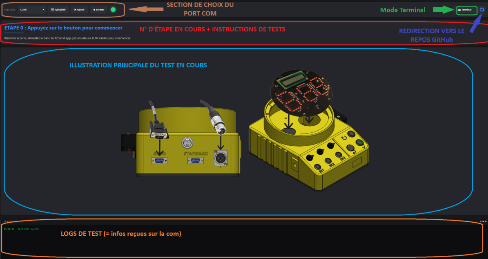
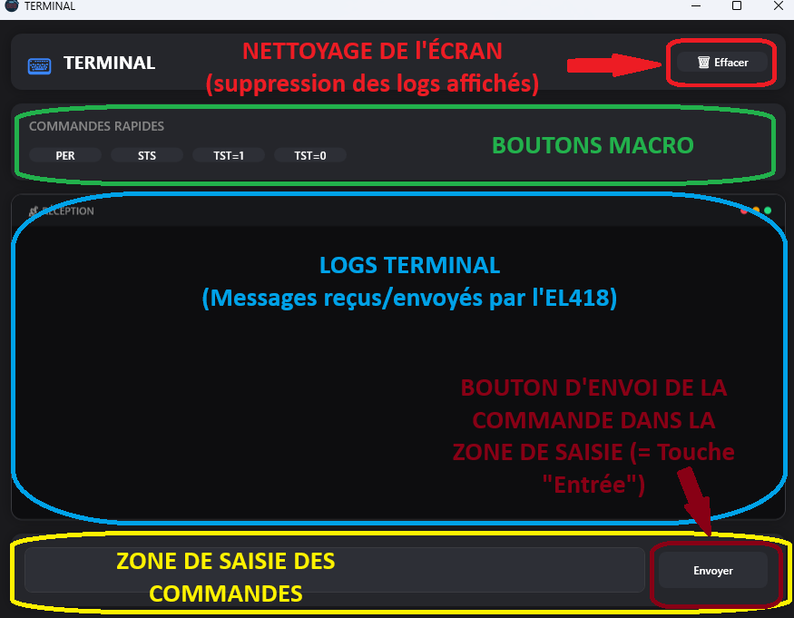

# 🧰 Application de Test EL418 

## 🧩 Présentation

**AppTestEL418** est une application **WPF (.NET)** développée dans le cadre du **banc de test EL418** pour **TTS (Trafic Technologie Système)**.  
Elle permet la **communication série (RS232)** avec la carte **banc de test EL418** dans le but de valider et diagnostiquer les modules électroniques des feux tricolores TEMPO® II.

L’application a été pensée pour offrir une interface moderne, ergonomique et fiable, facilitant et fiabilisant les opérations de test 

---

## 🚀 Fonctionnalités principales

- 🔌 Tests simplifiés : Test des fonctions de la cartes plus simples pour les techniciens
- 📡 Tests plus rigoureux et efficaces : exécution automatiques de certaines actions de tests
- 📊 Affichage et analyse en temps réel: analyse et interprétation des résultats de tests de façon automatique
- 🧱 Structure modulaire prête à évoluer vers des tests plus automatisés.

---

## 📁 Fichiers utiles

- Lien vers les fichiers de CAO électronique: https://github.com/EnzoPerrier/BancTestEL418-Electronique
- Lien vers les fichiers CAO 3D: https://www.thingiverse.com/thing:7192111
- Lien vers les fichiers sources du logiciel embarqué: https://github.com/EnzoPerrier/BANC_TEST_001_V100

---

## ⚙️ Prérequis

- Windows **10** ou **11** 
- [.NET 8 SDK](https://dotnet.microsoft.com/download)
- Visual Studio 2022 ou VS Code avec extension C#  
- Banc de test **ECME 286** (Avec carte banc de test pour EL418)
- Câble USB–série (ou adaptateur COM - RS232)

---

## 🧪 Utilisation

1. **Lancer l’application**  

2. **Configurer le port COM**  
- Choisir le bon port COM

3. **Démarrer la communication**  
- Cliquer sur “Ouvrir COM”.  
- Les infos de test et les indications s'affichent en temps réel

4. **Analyser les résultats**  
- Les statuts des tests apparaissent sous forme d’indicateurs colorés.

## 👨‍💻Présentation de l'interface

## 🛠️ Utilisation du Banc de Test

## 🧠 Notes techniques

- Implémentation basée sur `System.IO.Ports.SerialPort`.  
- Gestion UI thread-safe via `Dispatcher.Invoke()` / `Dispatcher.BeginInvoke()`.  
- Architecture compatible avec un futur découpage **MVVM**.  
- Peut évoluer vers une interface **multi-bancs** ou **multi-protocoles**.

## License

© 2026 Enzo PERRIER

This project is licensed for personal, non-commercial use only.
Commercial use, modification, and redistribution are prohibited
without prior written permission from the author.

A specific authorization is granted to **Trafic Technologie Système** to use this code for
internal purposes as part of its business activities.

